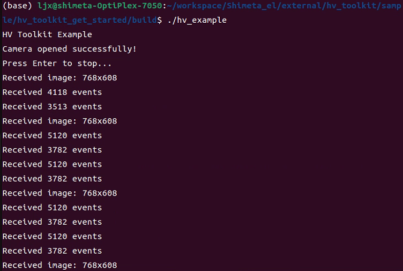
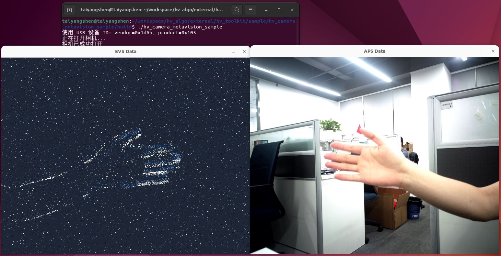
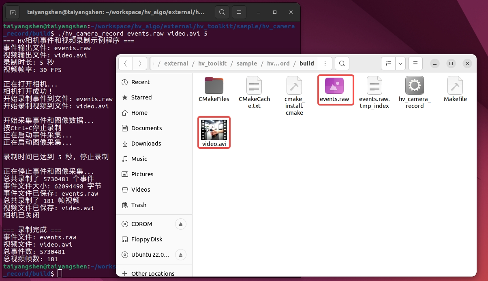
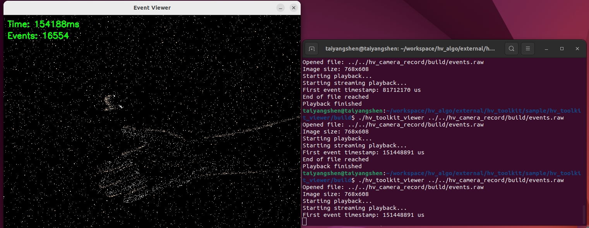
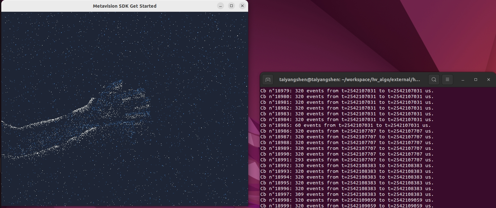
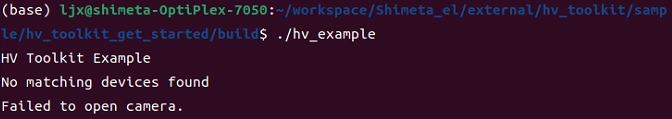
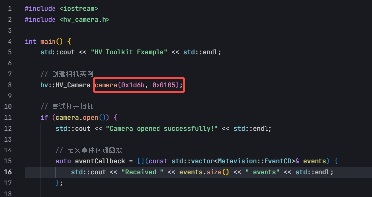

# HV Toolkit

**语言**: **中文** | [English](README_EN.md)

 HV Toolkit 是 ShiMetaPi 技术社区推出的 专为事件相机（DVS）设计的高性能C++ SDK，支持事件数据流（EVS）和图像数据流（APS）的实时采集与处理，兼容Prophesee Metavision EventCD格式，适用于高性能事件相机开发。

## 📋 技术规格

### 事件相机参数

- **EVS分辨率**：768×608（子采样：384×304）
- **APS分辨率**：768×608（可调）
- **数据传输**：USB 3.0高速传输
- **事件格式**：兼容Metavision EventCD/EVT2.0

### 系统要求

- **C++标准**：C++17 或更高版本
- **CMake**：3.10 或更高版本
- **操作系统**：Ubuntu 22.04

## 🔧 依赖说明

- **OpenCV**：图像处理与可视化（`libopencv-dev`）
- **libusb-1.0**：USB设备通信（`libusb-1.0-0-dev`）
- Hybrid Visoin SDK: ShimetaPi API
- Openeb：事件处理算法

## 🚀 快速开始

### 构建基于HV项目

```bash
# Ubuntu/Debian
sudo apt-get update
sudo apt-get install build-essential cmake libusb-1.0-0-dev libopencv-dev

# 给脚本添加执行权限
chmod +x install_libs.sh

# 安装到默认位置 (/usr/local)
./install_libs.sh

# 或者安装到指定位置
./install_libs.sh /path/to/install
```

### 运行示例程序

#### `hv_toolkit_get_started`

```bash
# 进入示例程序目录
cd sample/hv_toolkit_get_started

# 构建示例程序
mkdir build && cd build
cmake ..
make 
# 运行示例程序
./hv_toolkit_get_started
```

程序运行截图


#### `hv_camera_metavision_sample`

```bash
# 进入示例程序目录
cd sample/hv_camera_metavision_sample
# 构建示例程序
mkdir build && cd build
cmake..
make
# 运行示例程序
./hv_camera_metavision_sample
```

程序运行截图


#### `hv_camera_record`

```bash
# 进入示例程序目录
cd sample/hv_camera_record
# 构建示例程序
mkdir build && cd build
cmake..
make
# 运行示例程序
./hv_camera_record events.raw video.avi 5
```

程序运行截图


#### `hv_toolkit_viewer`

```bash
# 进入示例程序目录
cd sample/hv_toolkit_viewer
# 构建示例程序
mkdir build && cd build
cmake..
make
# 运行示例程序
./hv_toolkit_viewer ../../hv_camera_record/build/events.raw
```

程序运行截图


### 构建基于Openeb项目

####  `metavision_sdk_test`示例程序

```
# 安装openeb SDK
curl -L https://propheseeai.jfrog.io/artifactory/api/security/keypair/prophesee-gpg/public >/tmp/propheseeai.jfrog.op.asc
sudo cp /tmp/propheseeai.jfrog.op.asc /etc/apt/trusted.gpg.d
sudo add-apt-repository 'https://propheseeai.jfrog.io/artifactory/openeb-debian/'
sudo apt update
sudo apt -y install metavision-openeb
```

```bash
# 使用openeb打开相机需要先安装我们的相机插件
# 我们已经将相机插件编译成lib，使用如下命令复制到metavision的相机搜索路径下
sudo cp ./lib/libhal_camera_hal.so /usr/local/lib/metavision/hal/plugins/
# 进入示例程序目录
cd sample/metavision_sdk_test
# 构建示例程序
mkdir build && cd build
cmake..
make
# 运行示例程序
./metavision_sdk_test
```

程序运行截图


## 🚨 故障排除

### 常见问题

**问题1**: 无法找到USB设备&&LIBUSB_EERROR_ACCESS
如果出现报错**no match devices found**说明设备未成功连接

请检查USB设备是否连接以及vendor_id和product_id是否正确

配置正确，且将设备连接到主机后，运行程序出现**Cannot open device:LIBUSB_EERROR_ACCESS**这是由于未赋予权限导致的，执行下述指令即可

```bash
sudo chmod -R 777 /dev/bus/usb/
```

## 📁 项目结构

```
hv_toolkit/
├── CMakeLists.txt              # 主构建配置
├── README.md                   # 项目文档（中文）
├── README_EN.md                # 项目文档（英文）
├── API.md                      # API详细文档
├── include/                    # 头文件目录
│   ├── hv_camera.h             # 相机类头文件
│   ├── hv_event_reader.h       # 事件读取类头文件
│   ├── hv_event_writer.h       # 事件写入类头文件
│   ├── hv_events_format.h      # 事件格式定义
│   ├── hv_evt2_codec.h         # EVT2编解码器
│   └── hv_usb_device.h         # USB设备类头文件
├── lib/                        # 编译后的库文件
│   └── libhv_camera.so         # 动态链接库
├── sample/                     # 示例程序
│   ├── hv_camera_metavision_sample/      # Metavision集成示例
│   ├── hv_camera_record/                 # 事件录制示例
│   ├── hv_toolkit_get_started/           # 入门示例
│   ├── hv_toolkit_viewer/                # 事件可视化播放器
│   └── metavision_sdk_test/              # Metavision SDK测试
└── assets/                    # 资源文件
```

## 🔍 示例程序说明

### hv_camera_metavision_sample

集成HV Toolkit与Metavision SDK，演示事件流与图像流的同步采集与处理。该示例展示了如何将HV相机与Metavision算法库结合使用，实现高效的事件数据处理。

### hv_camera_record

演示如何采集并录制事件数据到本地raw文件。该示例包含完整的事件数据采集流程，支持实时录制和数据保存功能。

### hv_toolkit_get_started

基础入门示例，展示如何初始化相机、采集事件和图像数据。这是学习HV Toolkit的最佳起点，包含了基本的API使用方法和数据处理流程。

### hv_toolkit_viewer

事件数据可视化播放器，支持raw文件的读取、暂停、回放和帧生成显示。提供直观的事件数据可视化界面，便于数据分析和调试。

### metavision_sdk_test

Metavision SDK相关功能测试与演示。该示例展示了如何使用Metavision SDK的各种算法和功能，包括事件处理、特征检测等。

## 🙏 致谢

感谢以下开源项目对本项目的支持：

- [Prophesee Metavision SDK](https://docs.prophesee.ai/) - 事件处理算法
- [OpenCV](https://opencv.org/) - 计算机视觉库
- [libusb](https://libusb.info/) - USB设备通信库

---

## 🙋 联系我们

如果你在使用 HV Toolkit 过程中遇到任何问题或有任何建议，欢迎通过以下方式与我们联系：
开源硬件网站： https://www.shimetapi.cn  (国内)  https://www.shimetapi.com  (海外)
在线技术文档：https://forum.shimetapi.cn/wiki/zh/
在线技术社区：https://forum.shimetapi.cn
**HV Toolkit** - 让事件相机开发更简单 🚀
