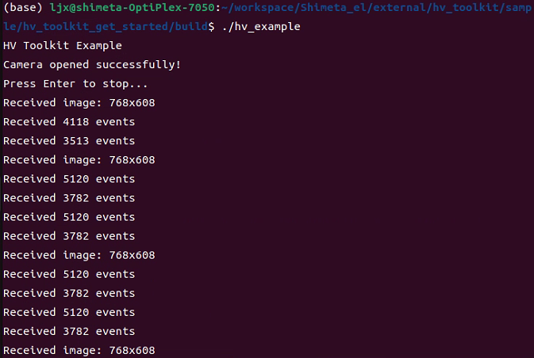
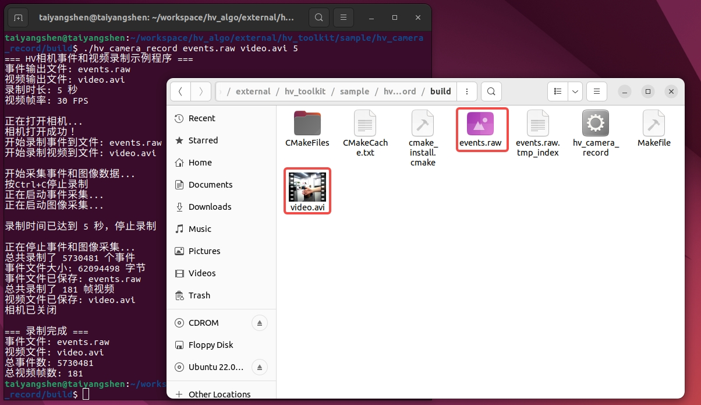
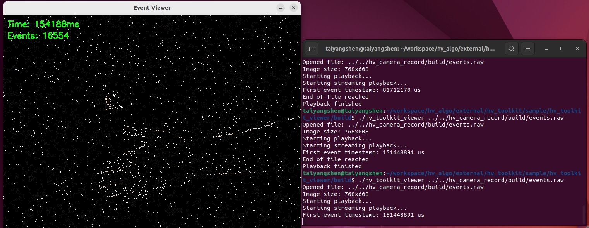
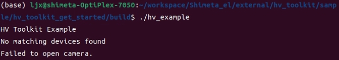
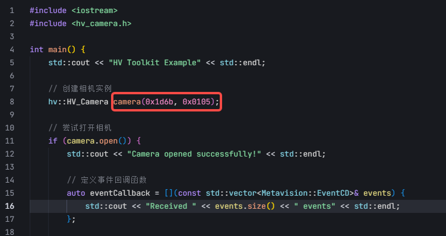

# HV Toolkit

**语言**: **中文** | [English](README_EN.md)

HV Toolkit（ShiMetaPi Hybrid Vision Toolkit）**v2.0** 是面向事件相机（DVS/EVS）的高性能 C++17 SDK，统一采集事件数据流（EVS）与图像数据流（APS），自带零第三方依赖的 EVT2/EVT3 编解码。v2.0 完成核心重写：**USB / MIPI / Ethernet 三后端统一为同一套 `Camera` API**，公有 API 表面不再依赖任何第三方事件 SDK。

> 本仓库为**预编译二进制发布版**（核心以 `.so` 闭源交付，仅公开头文件与示例源码）。
> `lib/x86_64/` 为 x86_64 Linux 库（USB + Ethernet 后端），`lib/s100/` 为 S100 aarch64 库（MIPI + Ethernet 后端）。

## ✨ v2.0 特性

- **三后端统一**：USB（libusb）/ MIPI（RDK，仅 ARM）/ Ethernet（POSIX TCP）—— 同一套 `Camera` 接口，后端由 `DeviceConfig.backend` 选择。
- **双回调 + 同步拉取**：`SetFrameCallback` / `SetEventCallback` / `SetImageCallback` 异步回调，`GetFrame` 同步拉取。
- **自洽编解码**：EVT2 / EVT3 / MIPI RAW8 的 `Encoder`/`Decoder`，零外部 SDK。
- **IO 读写**：`EventReader` / `EventWriter` / `HybridWriter` / `HybridReader`（RAW 文件读写 + EVS/APS 混合录制/回放）。
- **Python 绑定**（可选）：单一 `hv_toolkit` 模块（pybind11），x86_64 预编译（Python 3.10）。
- **零第三方事件 SDK 依赖**：公有表面已与旧版第三方事件 SDK 完全解耦。

## 📋 技术规格

### 事件相机参数

- **EVS 分辨率**：768×608（子采样：384×304）
- **APS 分辨率**：768×608
- **数据传输**：USB 3.0（USB 后端）/ MIPI-CSI（MIPI 后端）/ TCP（Ethernet 后端）
- **事件格式**：EVT2 / EVT3（兼容 Prophesee EventCD 语义）

### 系统要求

- **C++ 标准**：C++17 或更高
- **CMake**：3.16+
- **操作系统**：Linux —— x86_64（USB + Ethernet 后端）；aarch64/S100（MIPI + Ethernet 后端）

## 🔧 依赖

| 依赖 | 用途 | 必需 |
| --- | --- | --- |
| **libusb-1.0** | USB 后端运行库（`libusb-1.0-0`） | USB 后端 |
| **OpenCV** | `viewer` / `player` / `live_record_display` 示例 | 示例可选 |

> v2.0 **不再依赖**第三方事件 SDK —— 编解码为独立 clean-room 实现。OpenCV 仅在示例可视化中用到，非核心依赖。

```bash
# Ubuntu/Debian
sudo apt-get update
sudo apt-get install build-essential cmake libusb-1.0-0 libopencv-dev
```

## 🚀 快速开始

### 编译示例（链接预编译库）

预编译库随仓库分发，无需编译 SDK 本体；CMake 按目标架构自动选择 `lib/x86_64`（x86_64）或 `lib/s100`（aarch64）：

```bash
cd shimetapi_Hybrid_vision_toolkit
./run.sh build                  # = cmake 配置 + 编译（默认本机架构）
./run.sh --list                 # 查看预编译架构与就绪状态
```

也可直接用 cmake（等价）：

```bash
cmake -B out/x86_64/build -S .      # 构建目录 out/<arch>/build（与 run.sh 一致）
cmake --build out/x86_64/build -j    # 编出 7 个示例可执行文件
```

交叉编样例（如在 x86_64 上为 S100 板卡编）——链接 `lib/s100` 的 aarch64 库：

```bash
./run.sh build s100 -DCMAKE_TOOLCHAIN_FILE=<你的-aarch64-toolchain.cmake>
# OpenCV 类样例（player / live_record_display）交叉时需板端 OpenCV，缺省自动跳过
```

示例可执行文件已内嵌 rpath，直接运行即可（无需设置 `LD_LIBRARY_PATH`）：

```bash
./out/x86_64/build/samples/cpp/get_started/hv_sample_get_started
./out/s100/build/samples/cpp/get_started/hv_sample_get_started    # s100 交叉产物
```

在自己的工程中链接（CMake）：

```cmake
# 把本仓库作为子目录，或 install 后 find_package 均可
add_subdirectory(shimetapi_Hybrid_vision_toolkit)
target_link_libraries(your_app PRIVATE
    HVToolkit::shimetapi_hv HVToolkit::shimetapi_codec HVToolkit::shimetapi_io)
```

安装到系统（头文件 + 当前架构的库）：

```bash
cmake --install out/x86_64/build            # 默认 /usr/local
cmake --install out/x86_64/build --prefix /your/prefix
```

### 运行示例程序

#### `get_started` — 最小采集

```bash
./out/x86_64/build/samples/cpp/get_started/hv_sample_get_started          # USB 默认 0x1d6b:0x0105
./out/x86_64/build/samples/cpp/get_started/hv_sample_get_started 0x1d6b 0x0105   # 指定 VID PID
```

程序运行截图


#### `record` — 事件录制

```bash
./out/x86_64/build/samples/cpp/record/hv_sample_record events.raw 5
```

程序运行截图


#### `viewer` — 可视化回放

```bash
./out/x86_64/build/samples/cpp/viewer/hv_sample_viewer events.raw
```

程序运行截图


### Python 示例

Python 绑定（单一 `hv_toolkit` 模块，**x86_64 预编译**，要求 Python 3.10）随 `lib/x86_64/python/` 分发：

```bash
# 安装：拷入 site-packages（模块自带 $ORIGIN 解析，需与 lib/x86_64/ 的 .so 保持相对布局，
# 即 python/ 目录与其上级 libshimetapi_*.so 同级）
python3 -c "import site; print(site.getsitepackages()[0])"   # 找到 site-packages 路径
cp -a lib/x86_64/python/hv_toolkit.*.so <site-packages>/
# 同时把 lib/x86_64/libshimetapi_*.so* 拷到 <site-packages>/hv_toolkit_libs/ 或系统库路径

# 或不安装直接用（仓库根目录下）
python3 samples/python/get_started.py
```

> 最省事的部署：`sudo ./run.sh install x86_64` 把库装进系统路径后，`hv_toolkit` 模块可直接 `import`。

USB 最小采集（`frame.evs` 是原始事件字节，用 `Evt2Decoder` 解码）：

```python
import hv_toolkit as hv

cfg = hv.DeviceConfig()
cfg.backend    = hv.Backend.Usb
cfg.vendor_id  = 0x1d6b
cfg.product_id = 0x0105

cam = hv.Camera()
cam.init(cfg)
cam.start_stream()

dec = hv.Evt2Decoder()
f = hv.Frame()
for _ in range(10):
    if cam.get_frame(f, 1000):
        events = dec.decode(bytes(f.evs))   # → numpy 结构数组 (x, y, t, polarity)
        print(f"frame {f.frame_id} {f.width}x{f.height}: {len(events)} events, aps={f.aps.nbytes} bytes")
cam.stop_stream()
cam.destroy()
```

MIPI HVS 只换 backend 与解码器（`Frame.evs` 是 RAW8 子帧流，用 `MipiRaw8Decoder`）：

```python
cfg = hv.DeviceConfig()
cfg.backend      = hv.Backend.MipiHvs
cfg.sensor_index = 0       # 不用 VID/PID
cfg.evs_fps      = 500     # 帧率档（0=默认 240；可选 120/240/300/500/750/1000，Init 时生效）
cfg.i2c_bus      = 1
dec = hv.MipiRaw8Decoder()  # 不是 Evt2Decoder
```

完整 MIPI 样例见 [`samples/python/get_started_mipi.py`](samples/python/get_started_mipi.py)。

> **帧率档**：`cfg.evs_fps`（0=默认 240）。档位与 EVS 整包子帧数对应——120fps=16、240fps=32、300fps=40、500fps=64、750fps=100、1000fps=128 子帧；`MipiRaw8Decoder.decode` 不传 `subframe_count` 时自动按数据长度适配，任意档位无需手传。档位在 `Init` 时选定（MIPI 运行中切档需重建管线，不支持 `SetFrameRate`）。

**S100 部署运行**：把 `lib/s100/` 下的 `libshimetapi_*.so*` 拷到板卡（如 `/app/lib`），设库路径后用 C++ 示例：

```bash
# 在 S100 板卡上
export LD_LIBRARY_PATH=/app/lib:$LD_LIBRARY_PATH
./hv_sample_get_started            # x86 预编译 Python 模块不能在 aarch64 板上用
```

> Python 模块目前导出 `Camera` / `DeviceConfig` / `Frame`（含 `evs`/`aps` 零拷贝 numpy 视图）/ `Evt2`、`Evt3`、`MipiRaw8` 编解码器 / `extract_evs_timestamp`。回调、`EventReader/Writer`、`HybridReader` 暂未导出 —— 需要时用 C++ API（见 [API.md](API.md)）。

### USB 设备权限

首次运行若报 `LIBUSB_ERROR_ACCESS`，推荐配置 udev 规则（免 sudo）：

```bash
echo 'SUBSYSTEM=="usb", ATTR{idVendor}=="1d6b", ATTR{idProduct}=="0105", MODE="0666"' \
  | sudo tee /etc/udev/rules.d/99-hv-camera.rules
sudo udevadm control --reload-rules && sudo udevadm trigger
```

## 🚨 故障排除

### 无法找到 USB 设备 / LIBUSB_ERROR_ACCESS

如果出现 **no match devices found**，说明设备未成功连接。



请检查 USB 设备是否连接、`vendor_id` / `product_id` 是否正确。



配置正确且设备已连接，但运行报 **Cannot open device: LIBUSB_ERROR_ACCESS** —— 这是权限不足导致，执行下述指令即可：

```bash
# 临时：放开 USB 总线权限
sudo chmod -R 777 /dev/bus/usb/
# 推荐：见上文 udev 规则（免 sudo，持久）
```

## 📁 项目结构

```
shimetapi_Hybrid_vision_toolkit/
├── CMakeLists.txt              # 预编译库接入配置（IMPORTED 目标 + 示例 + 安装规则）
├── README.md / README_EN.md    # 项目文档（中/英）
├── API.md / API_EN.md          # 公有 API 参考（中/英）
├── include/shimetapi/          # 公有头文件
│   ├── core/                   # EventCD / Status / BufferPool / Frame / PixelFormat / Timestamp
│   ├── hv/                     # Camera / DeviceConfig / EventFormat / EventPacket / ImageData
│   ├── codec/                  # EVT2 / EVT3 / MIPI RAW8 编解码
│   └── io/                     # EventReader / EventWriter / HybridWriter / HybridReader
├── lib/                        # 预编译库（闭源二进制）
│   ├── x86_64/                 # x86_64：USB + Ethernet 后端（含 python/ 绑定模块）
│   └── s100/                   # S100 aarch64：MIPI + Ethernet 后端
├── samples/                    # 示例
│   ├── cpp/                    # C++ 示例
│   │   ├── get_started/        # 最小采集
│   │   ├── callback/           # 双回调演示
│   │   ├── record/             # 事件录制
│   │   ├── viewer/             # 可视化回放
│   │   ├── bench_hw/           # 实机 USB 性能基准
│   │   ├── live_record_display/  # MIPI-HVS 实时预览 + 录制
│   │   └── player/             # 离线回放（EVS+APS）
│   └── python/                 # Python 示例
└── docs/                       # 板端冒烟记录
```

## 🔍 示例程序说明

### get_started

基础入门示例，展示如何初始化相机、同步拉取帧、解码事件。这是学习 HV Toolkit 的最佳起点。

### callback

双回调演示（事件 + APS 异步回调），展示 `SetEventCallback` / `SetImageCallback` 的用法。

### record

事件录制示例，把相机事件流写入 RAW 文件，支持 `writeRaw`（直写）和 `writeEvents`（编码后写）两种路径。

### viewer

事件可视化播放器，读取 RAW 文件并用 OpenCV 累加显示，支持暂停、回放。

### bench_hw

实机 USB 性能基准（默认 `0x1d6b:0x0105 5` 秒），打印 Mev/s 与 APS fps。

### live_record_display

MIPI-HVS 实时预览 + 按键录制（`r` 键开关录制）。同时显示 EVS 可视化和 APS 图像，使用 `HybridWriter` 写入 EVS raw + APS AVI。

### player

离线回放录制文件（`.raw` + `.avi`），使用 `HybridReader` 读取、`MipiRaw8Decoder` 解码，带 GUI 按钮（播放/暂停/步进/变速/同步）。

## 📄 版权声明

版权所有 © ShiMetaPi。本仓库以预编译二进制形式分发 HV Toolkit 运行库；头文件与示例代码供集成开发使用。未经书面许可，不得反向工程、反汇编库文件或再分发其中的二进制组件。EVT2/EVT3 编解码为基于公开规范的独立实现（clean-room）。

---

## 🙋 联系我们

如果你在使用 HV Toolkit 过程中遇到任何问题或有任何建议，欢迎通过以下方式与我们联系：

开源硬件网站：https://www.shimetapi.cn （国内） / https://www.shimetapi.com （海外）
在线技术文档：https://forum.shimetapi.cn/wiki/zh/
在线技术社区：https://forum.shimetapi.cn

**HV Toolkit** - 让事件相机开发更简单 🚀
