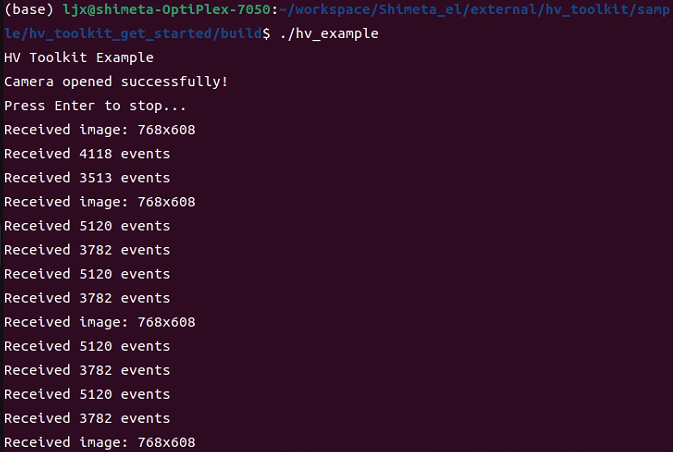
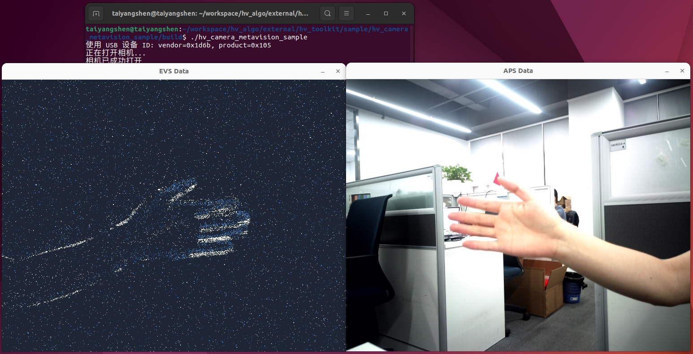
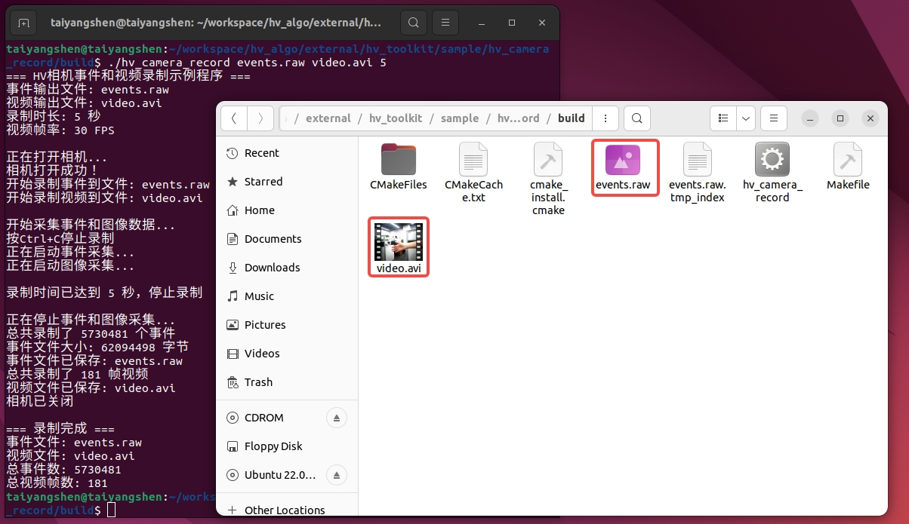
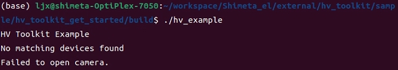

# HV Toolkit

**Language**: [中文](README.md) | **English**

HV Toolkit is a high-performance C++ SDK designed specifically for event cameras (DVS) by the ShiMetaPi technology community. It supports real-time acquisition and processing of event data streams (EVS) and image data streams (APS), compatible with Prophesee Metavision EventCD format, suitable for high-performance event camera development.

## 📋 Technical Specifications

### Event Camera Parameters
- **EVS Resolution**: 768×608 (Subsampling: 384×304)
- **APS Resolution**: 768×608 (Adjustable)
- **Data Transmission**: USB 3.0 High-Speed Transfer
- **Event Format**: Compatible with Metavision EventCD/EVT2.0

### System Requirements
- **C++ Standard**: C++17 or higher
- **CMake**: 3.10 or higher
- **Operating System**: Ubuntu 22.04

## 🔧 Dependencies

- **OpenCV**: Image processing and visualization (`libopencv-dev`)
- **libusb-1.0**: USB device communication (`libusb-1.0-0-dev`)
- **Metavision SDK**: Event processing algorithms (`metavision-openeb`)

### Installing Dependencies

```bash
# Ubuntu/Debian
sudo apt-get update
sudo apt-get install build-essential cmake libusb-1.0-0-dev libopencv-dev
# Install Metavision SDK
curl -L https://propheseeai.jfrog.io/artifactory/api/security/keypair/prophesee-gpg/public >/tmp/propheseeai.jfrog.op.asc
sudo cp /tmp/propheseeai.jfrog.op.asc /etc/apt/trusted.gpg.d
sudo add-apt-repository 'https://propheseeai.jfrog.io/artifactory/openeb-debian/'
sudo apt update
sudo apt -y install metavision-openeb
```

## 🚀 Quick Start

### Building the Project

```bash
# Add execution permissions to the script
chmod +x install_libs.sh

# Install to the default location (/usr/local)
./install_libs.sh

# Or install it to the designated location
./install_libs.sh /path/to/install
```

### Running Sample Programs

Using `hv_toolkit_get_started` as an example:

```bash
# Enter sample program directory
cd sample/hv_toolkit_get_started

# Build sample program
mkdir build && cd build
cmake ..
make 
# Run sample program
./hv_toolkit_get_started
```
Program running screenshot  
   

Running `hv_camera_metavision_sample` sample program
```bash
# Enter sample program directory
cd sample/hv_camera_metavision_sample
# Build sample program
mkdir build && cd build
cmake..
make
# Run sample program
./hv_camera_metavision_sample
```
Program running screenshot
  

Running `hv_camera_record` sample program
```bash
# Enter sample program directory
cd sample/hv_camera_record
# Build sample program
mkdir build && cd build
cmake..
make
# Run sample program
./hv_camera_record events.raw video.avi 5
```
Program running screenshot
  

Running `hv_toolkit_viewer` sample program
```bash
# Enter sample program directory
cd sample/hv_toolkit_viewer
# Build sample program
mkdir build && cd build
cmake..
make
# Run sample program
./hv_toolkit_viewer ../../hv_camera_record/build/events.raw
```
Program running screenshot
  

Running `metavision_sdk_test` sample program
```bash
# To use metavision to open the camera, you need to install our camera plugin first
# We have compiled the camera plugin into a lib, use the following command to copy it to metavision's camera search path
sudo cp ./lib/libhal_camera_hal.so /usr/local/lib/metavision/hal/plugins/
# Enter sample program directory
cd sample/metavision_sdk_test
# Build sample program
mkdir build && cd build
cmake..
make
# Run sample program
./metavision_sdk_test
```
Program running screenshot


## 🚨 Troubleshooting

### Common Issues

**Issue 1**: Cannot find USB device && LIBUSB_ERROR_ACCESS
If you encounter the error **no match devices found**, it means the device is not successfully connected

Please check if the USB device is connected and if the vendor_id and product_id are correct

If configured correctly and the device is connected to the host, running the program shows **Cannot open device:LIBUSB_ERROR_ACCESS**. This is due to insufficient permissions. Execute the following command:
```bash
sudo chmod -R 777 /dev/bus/usb/
```

## 📁 Project Structure

```
hv_toolkit/
├── CMakeLists.txt              # Main build configuration
├── README.md                   # Project documentation (Chinese)
├── README_EN.md                # Project documentation (English)
├── API.md                      # Detailed API documentation
├── include/                    # Header files directory
│   ├── hv_camera.h             # Camera class header
│   ├── hv_event_reader.h       # Event reader class header
│   ├── hv_event_writer.h       # Event writer class header
│   ├── hv_events_format.h      # Event format definitions
│   ├── hv_evt2_codec.h         # EVT2 codec
│   └── hv_usb_device.h         # USB device class header
├── lib/                        # Compiled library files
│   └── libhv_camera.so         # Dynamic link library
├── sample/                     # Sample programs
│   ├── hv_camera_metavision_sample/      # Metavision integration sample
│   ├── hv_camera_record/                 # Event recording sample
│   ├── hv_toolkit_get_started/           # Getting started sample
│   ├── hv_toolkit_viewer/                # Event visualization player
│   └── metavision_sdk_test/              # Metavision SDK test
└── assets/                    # Resource files
```

## 🔍 Sample Program Descriptions

### hv_camera_metavision_sample
Integrates HV Toolkit with Metavision SDK, demonstrating synchronized acquisition and processing of event streams and image streams. This sample shows how to combine HV cameras with Metavision algorithm libraries for efficient event data processing.

### hv_camera_record
Demonstrates how to acquire and record event data to local raw files. This sample includes a complete event data acquisition pipeline with real-time recording and data saving capabilities.

### hv_toolkit_get_started
Basic getting started sample that shows how to initialize cameras, acquire event and image data. This is the best starting point for learning HV Toolkit, containing basic API usage methods and data processing workflows.

### hv_toolkit_viewer
Event data visualization player that supports reading, pausing, playback, and frame generation display of raw files. Provides an intuitive event data visualization interface for data analysis and debugging.

### metavision_sdk_test
Metavision SDK related functionality testing and demonstration. This sample shows how to use various algorithms and features of the Metavision SDK, including event processing, feature detection, etc.

## 🙏 Acknowledgments

Thanks to the following open source projects for their support:
- [Prophesee Metavision SDK](https://docs.prophesee.ai/) - Event processing algorithms
- [OpenCV](https://opencv.org/) - Computer vision library
- [libusb](https://libusb.info/) - USB device communication library

---
## 🙋 Contact Us
If you encounter any problems or have any suggestions while using HV Toolkit, please feel free to contact us through the following methods:
Open Source Hardware Website: www.shimetapi.cn (Domestic) www.shimetapi.com (Overseas)
Online Technical Documentation: https://forum.shimetapi.cn/wiki/zh/
Online Technical Community: https://forum.shimetapi.cn
**HV Toolkit** - Making event camera development easier 🚀